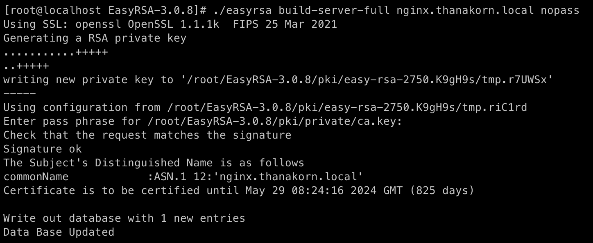
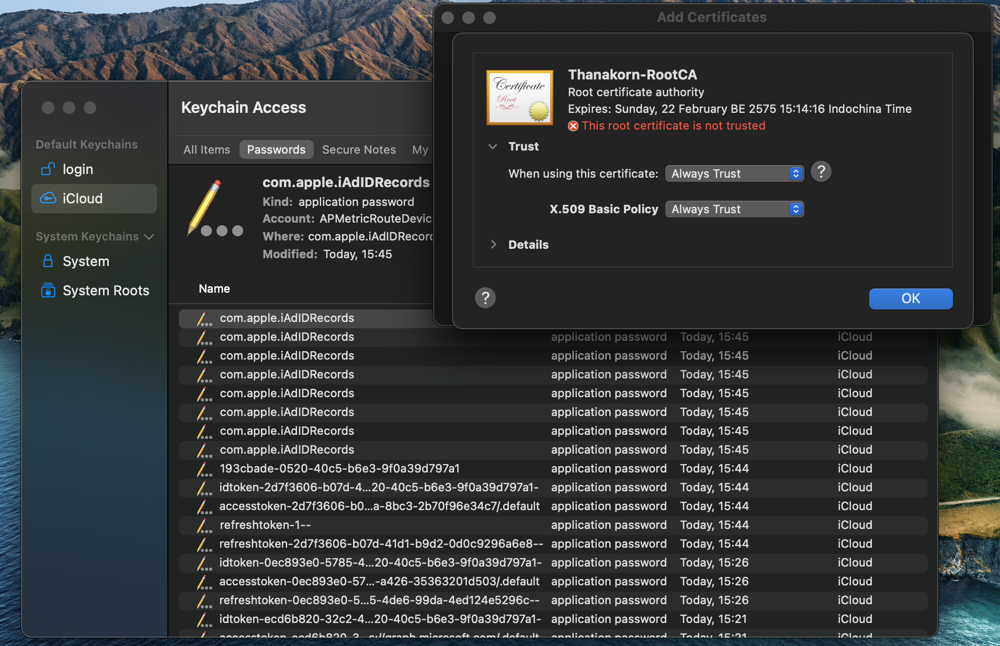
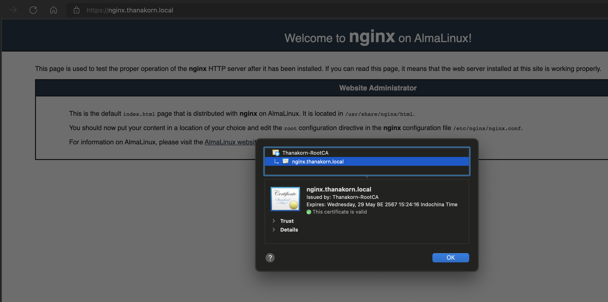

# How to build easy Certificate Authority

| ***Date*** | 24-02-2022 |
| --- | --- |
| ***Author*** | Thanakorn P. |

วันนี้เราจะมาลองทำ Certificate Authority ง่ายๆ เพื่อใช้ Issue certificate สำหรับ lab ต่างๆ ของเรากันครับ

ทำการ install tool ต่างๆ เพื่อใช้งานเกี่ยวกับการ install easyrsa กัน

```sh
dnf install wget tar -y
```

จากนั้นทำการ Download package ของ easyrsa ที่อยู่บน github ด้วย command

```sh
wget https://github.com/OpenVPN/easy-rsa/releases/download/v3.0.8/EasyRSA-3.0.8.tgz
```

จากนั้นทำการ Extract package ด้วย command

```sh
tar -xvf EasyRSA-3.0.8
```

เราก็จะได้ Directory EasyRSA-3.0.8 มา ให้ทำการ cd เข้าไปด้านใน

```sh
cd EasyRSA-3.0.8
```

จากนั้นทำการทำ Public key infrastructure โดย command

```sh
./easyrsa init-pki
```

จากนั้นทำการสร้าง Root CA โดย command

```sh
./easyrsa build-ca
```

easyrsa จะให้เราใส่ค่าดังนี้

```sh
Enter New CA Key Passphrase: [ใส่ Password ของ RootCA]
Re-Enter New CA Key Passphrase: [ใส่ Password เดียวกับ ด้านบน]

Common Name (eg: your user, host, or server name) [Easy-RSA CA]: [ตั้งชื่อให้กับ Root CA ของเรา]
```

ลองทดสอบ Generate certificate เพื่อใช้กับ Server โดยจะมี common name ชื่อว่า nginx.thanakorn.local ใช้ command

```sh
./easyrsa build-server-full nginx.thanakorn.local nopass

จากนั้น easyrsa จะถาม passpharse ของ Root CA ที่เราได้ตั้งไว้

Enter pass phrase for /root/EasyRSA-3.0.8/pki/private/ca.key: [Password Root CA]
```



Certificate จะถูก Generate และวางไว้ที่ path /EasyRSA-3.0.8/pki/issued/ และ Key ของ Certificate จะถูกวางไว้ที่ที่ path /EasyRSA-3.0.8/pki/private/

ผมได้ทำการทดสอบ Certificate โดยนำไปใช้กับ nginx โดย เพิ่ม config ของ nginx ในส่วนของ https ดังนี้

```vim
server {
        listen       443 ssl http2 default_server;
        listen       [::]:443 ssl http2 default_server;
        server_name  _;
        root         /usr/share/nginx/html;

        ssl_certificate "/root/EasyRSA-3.0.8/pki/issued/nginx.thanakorn.local.crt";
        ssl_certificate_key "/root/EasyRSA-3.0.8/pki/private/nginx.thanakorn.local.key";
        ssl_session_cache shared:SSL:1m;
        ssl_session_timeout  10m;
        ssl_ciphers PROFILE=SYSTEM;
        ssl_prefer_server_ciphers on;

        # Load configuration files for the default server block.
        include /etc/nginx/default.d/*.conf;

        location / {
        }

        error_page 404 /404.html;
            location = /40x.html {
        }

        error_page 500 502 503 504 /50x.html;
            location = /50x.html {
        }
    }
```

จากนั้นนำ Root CA Certificate ที่อยู่ใน path /EasyRSA-3.0.8/pki/ca.crt ไปติดตั้งที่เครื่อง client โดยผมใช้ MacOS ก็จะนำ root CA ไปที่ติดตั้งที่ keychain 




และเนื่องจากไม่ได้มีการทำ DNS ให้กับ Nginx ผมเลยใช้วิธีการ Set hosts file ของเครื่อง เพื่อที่จะได้เข้าถึงเครื่อง nginx ผ่าน common name ที่เราเตรียมไว้ได้

เมื่อทำทั้ง 2 อย่างเสร็จเรียบร้อย เราก็ทำการทดสอบโดยการเข้า Nginx ผ่าน protocol https ก็จะเห็นว่า Certificate ที่เราทำการใช้งาน สามารถใช้งานได้ และสามารถทำให้ web browser trust certificate ที่ออกโดย Certificate Authority ของเราได้ตามภาพด้านล่างครับ

