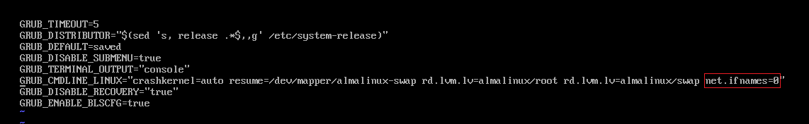
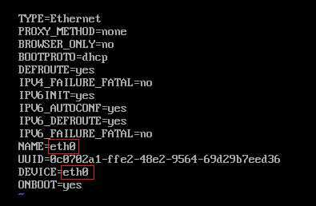

# Change Default NIC name from ens to eth

| ***Date*** | 25-01-2022 |
| --- | --- |
| ***Author*** | Thanakorn P. |

ทำการแก้ไข file ที่ path /etc/default/grub

```sh
vi /etc/default/grub
```

และทำการเพิ่มคำสั่ง net.ifnames=0 ไปที่ด้านหลังของบรรทัดตามรูปด้านล่าง



จากนั้น Run คำสั่งนี้เพื่อ setting configuration ใหม่

```sh
grub2-mkconfig -o /boot/grub2/grub.cfg
```

ทำการเปลี่ยนชื่อ NIC configuration file จากเดิมที่ชื่อ ens160 เป็น eth0

```sh
mv /etc/sysconfig/network-scripts/ifcfg-ens160 /etc/sysconfig/network-scripts/ifcfg-eth0
```

และตามไปแก้ configuration ด้านใน file ให้เป็นชื่อ NIC แบบใหม่ ตามรูปด้านล่าง

```sh
vi /etc/sysconfig/network-scripts/ifcfg-eth0
```



จากนั้นทำการ save file และ ทำการ reboot ก็เรียบร้อย