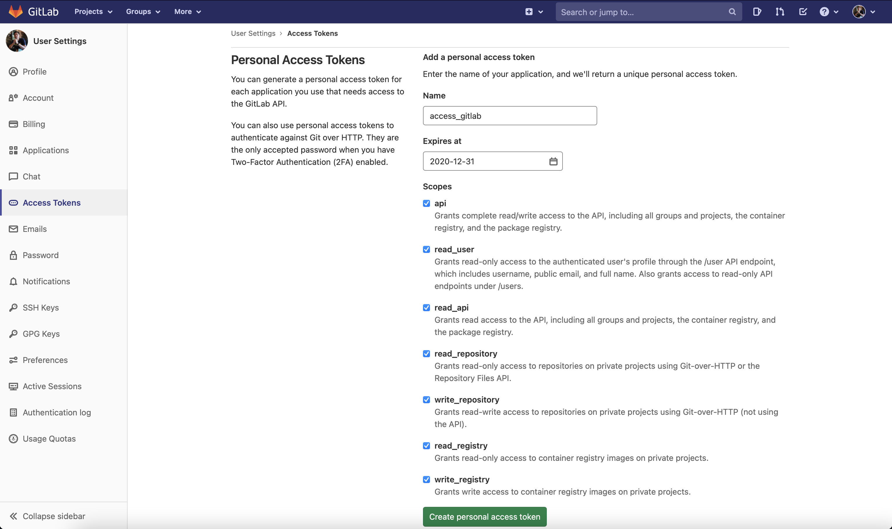
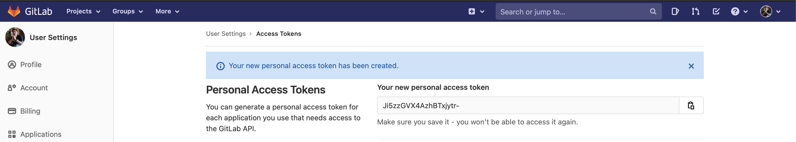
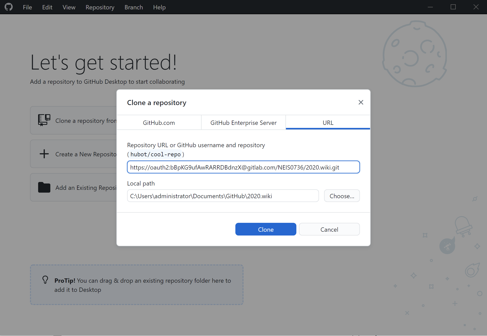
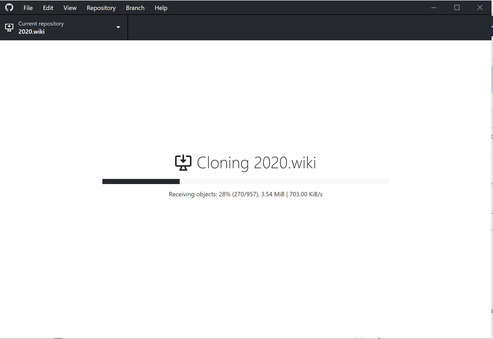

## การ Generate Access Token เพื่อใช้งาน Gitlab ที่เปิด 2 factor authentication
Author : Thanakorn P.
Create date : 30 Nov 2020
***
หากท่านใดมีปัญหาการ clone git จาก gitlab แล้ว repository นั้นต้องการยืนยันตัวตนของท่านด้วย account ของ Gitlab แต่เผอิญ Gitlab ของท่าน ดันเปิด 2 factor authentication เอาไว้ ทำให้ไม่สามารถ clone repository วันนี้ **เรามีตัวช่วย!!**

ก่อนอื่นให้เราไป Generate "Access token" ที่ Gitlab ของเราก่อน

1. ใส่ name ให้กับ access token
1. กำหนดวัน expire
1. Check box ว่าอยากให้ access token ของเรามีสิทธิ์ทำอะไรได้บ้าง
1. จากนั้นกด Create personal access token

เราก็จะได้ Access Token มา 1 ea

จากนั้นกลับมาที่ Github Desktop ของเรา Clone ด้วย pattern นี้
`https://oauth2:[Access Token]@gitlab.com/project`

เรียบร้อย Clone ได้แล้ว
