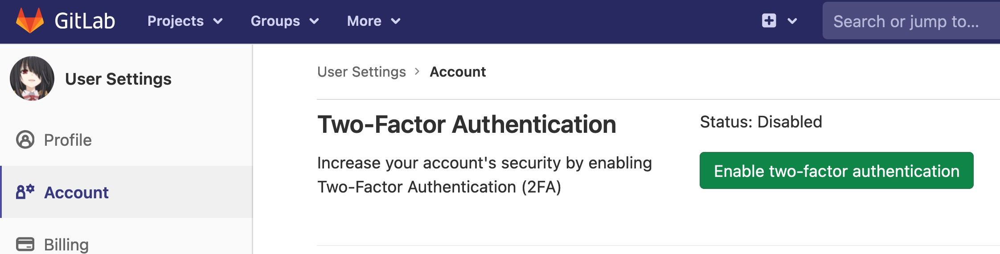

# How to enable Two Factor authentication on Gitlab.com
***
1. ทำการ login เข้า Gitlab และไปที่ Setting --> Account จะพบ Button ให้ทำการ enable Two-Factor Authentication

2. หลังจากกด button "Enable two-factor authentication แล้ว ระบบจะทำการ Generate QR code มาให้

3. ให้นำ application ที่จะในการทำ Multi-factor application มา scan เพื่อจับคู่ Gitlab account และ Multi-factor application