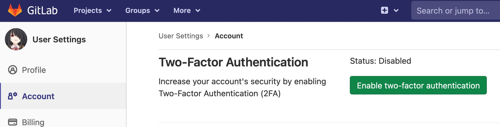
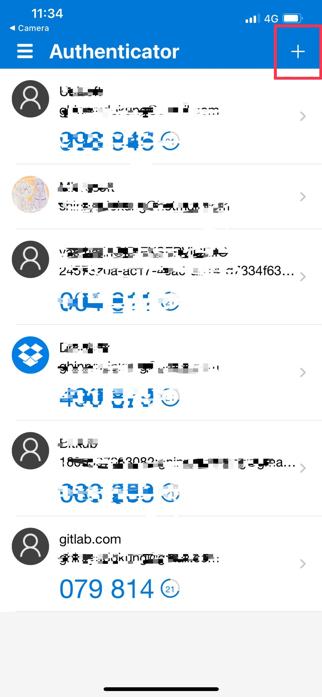
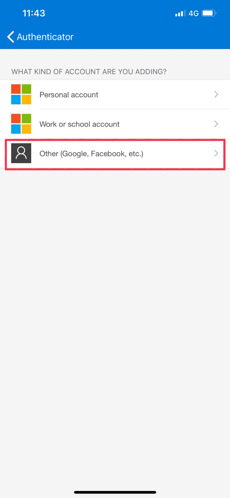
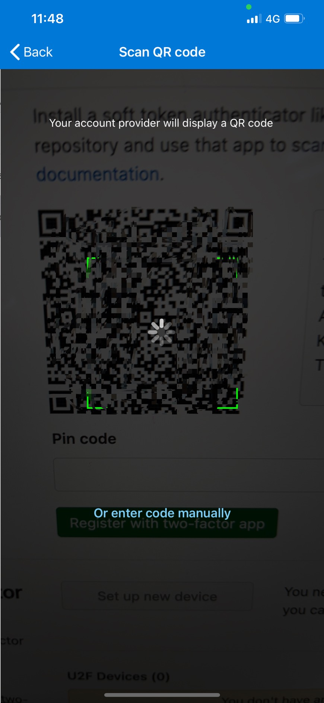
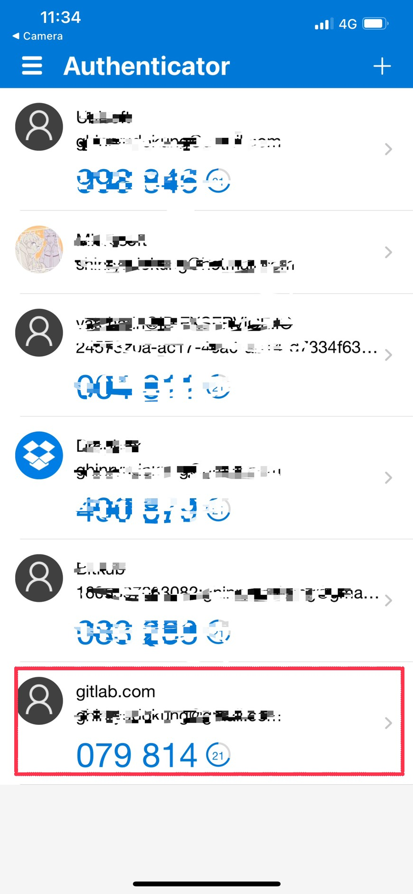
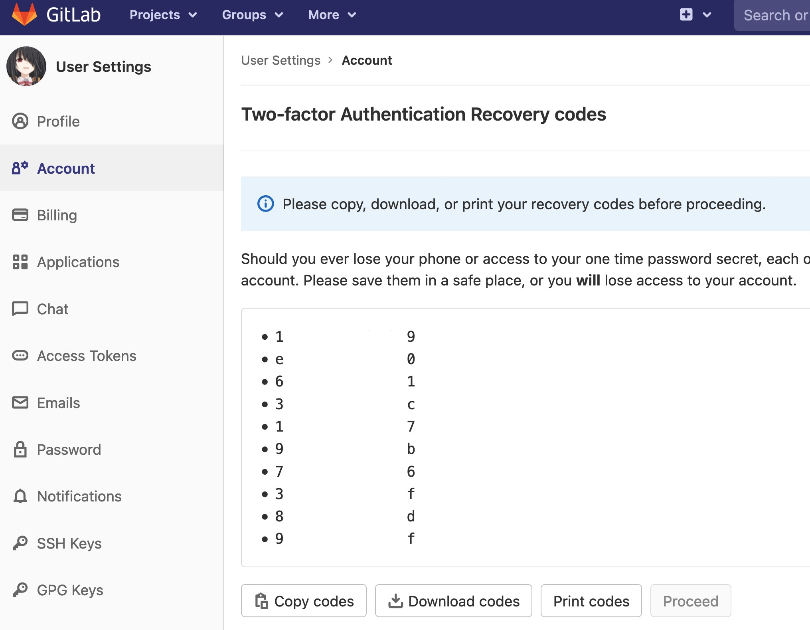

# How to enable Two-Factor authentication on GitLab.com
***

| ***Date*** | 20-12-2020 |
| ---- | ---- |
| ***Author*** | Thanakorn Prajuabkamon |
|  | Vatcharin Kongsakul |

***

1. ทำการ login เข้า Gitlab และไปที่ Setting --> Account จะพบ Button ให้ทำการ enable Two-Factor Authentication

2. หลังจากกด button "Enable two-factor authentication แล้ว ระบบจะทำการ Generate QR code มาให้

3. ให้นำ application ที่จะในการทำ Multi-factor application (ใน KB นี้ใช้ Application Microsoft Authenticator บน IOS ) มา scan เพื่อจับคู่ Gitlab account และ Multi-factor applicationin เริ่มจากการเปิด Application Microsoft Authenticator และกดปุ่มสัญลักษณ์ "+"

4. เลือก Other

5. ทำการ scan QR code ที่แสดงใน GitLab.com

6. เมื่อทำการจับคู่เรียบร้อย ให้นำ passcode ของ account GitLab ไปใส่ในหน้า setting ของ GitLab.com

7. นำ Passcode จาก Microsoft Authenticator มาใส่ และกด "Register with two-factor app"

8. ให้ทำการสำรองข้อมูล recovery code เผื่อในกรณีฉุกเฉิน เป็นอันสิ้นสุดวิธีการ Enable Two-Factor Authentication บน GitLab.com

