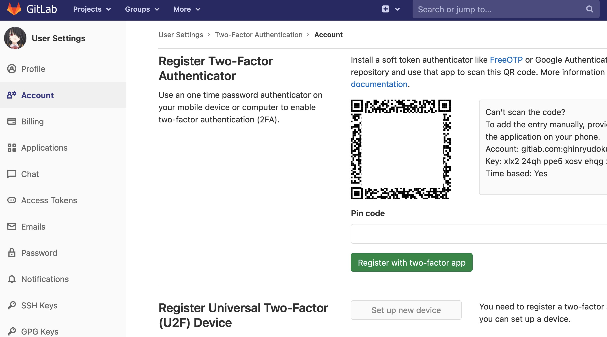

# How to enable Two-Factor authentication on GitLab.com
***

| ***Date*** | 20-12-2020 |
| ---- | ---- |
| ***Author*** | Thanakorn Prajuabkamon |
|  | Vatcharin Kongsakul |

***

* ทำการ login เข้า Gitlab และไปที่ Setting --> Account จะพบ Button ให้ทำการ enable Two-Factor Authentication

* หลังจากกด button "Enable two-factor authentication แล้ว ระบบจะทำการ Generate QR code มาให้

* ให้นำ application ที่จะในการทำ Multi-factor application (ใน KB นี้ใช้ Application Microsoft Authenticator บน IOS ) มา scan เพื่อจับคู่ Gitlab account และ Multi-factor applicationin เริ่มจากการเปิด Application Microsoft Authenticator และกดปุ่มสัญลักษณ์ "+"

* เลือก Other

* ทำการ scan QR code ที่แสดงใน GitLab.com

* เมื่อทำการจับคู่เรียบร้อย ให้นำ passcode ของ account GitLab ไปใส่ในหน้า setting ของ GitLab.com

* นำ Passcode จาก Microsoft Authenticator มาใส่ และกด "Register with two-factor app"

* ให้ทำการสำรองข้อมูล recovery code เผื่อในกรณีฉุกเฉิน เป็นอันสิ้นสุดวิธีการ Enable Two-Factor Authentication บน GitLab.com

