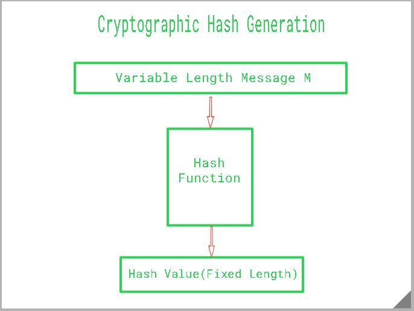

# How to check file hash in python

| ***Date*** | xx-01-2021 |
| --- | --- |
| ***Author*** | Thanakorn P. |

Integrity เป็นหนึ่งในองค์ประกอบของ Secuirty ซึ่งเราหลายๆ คนน่าจะรู้กันดี และหนึ่งในวิธีการที่ใช้พิสูจน์ Integrity ของ file ที่ได้รับความนิยม ก็คือการเทียบ Hash value วันนี้เลยจะมาลองสร้าง hash ของ file โดยใช้ Library ของ python ที่ชื่อว่า 
[filehash](https://pypi.org/project/filehash/) กัน

## Hash คืออะไร?
คือการนำข้อมูลหนึ่ง มาผ่าน Hash function แล้วจะได้ค่า Hash value ที่มีความยาวตาม Hash function ที่ใช้ในการทำ เช่น Hash function SHA-256 จะมีความยาวของ Hash value = 256bit


Credit Image : [https://www.geeksforgeeks.org/cryptographic-hash-function-in-java/](https://www.geeksforgeeks.org/cryptographic-hash-function-in-java/)

เรามาเริ่มเขียนโปรแกรมเพื่อ Generate Hash value ของ file กัน

***Source code***

```python
from filehash import FileHash

sha256hasher = FileHash('sha256')

hash_value = sha256hasher.hash_file("./NEIS0736NECS0736.txt")

print(f'hash value : {hash_value}')
```

จาก Code ด้านบน เราจะทำการ import function FileHash มาจาก library ที่ชื่อ filehash นำมา hash file ที่มีชื่อว่า NEIS0736NECS0736.txt และแสดง Hash Value ออกมา ตามด้านล่าง

***Result***

```sh
hash value : 6e1267b937252d9efc44d2f891a830713f3825e88e6a3650addf4b1a805248fa
```

จะเห็นได้ว่าการ Generate Hash value นั้นไม่อยากเลย ก็ลองนำไปปรับใช้ในงานที่ต้องการ check Integrity ของ file กันดูนะครับ

***ref*** : https://pypi.org/project/filehash/