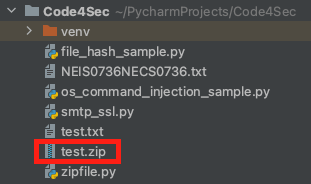
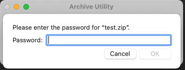

# How to create zip file with password in python.


Credit : [Image Source](https://www.winzip.com)

| ***Date*** | 16-01-2021 |
| --- | --- |
| ***Author*** | Thanakorn P. |

ถ้าจะพูดถึงการบีบอัดไฟล์ ให้มีขนาดเล็กลง หรือการรวบรวมไฟล์หลายๆ ไฟล์ เข้าด้วยกันเป็นไฟล์เดียว สิ่งที่เราจะคิดถึงน่าจะเป็นการทำ zip file และถ้าพูดถึงการป้องกัน zip file เราก็จะนึกถึงการใส่ password ให้กับ zip file 

วันนี้ผมเลยจะมาลองทำ zip file ที่มีการใส่ password เพื่อป้องกัน ด้วย library ของ python ที่มีชื่อว่า pyminizip กัน โดยเริ่มจากสิ่งแรกก็คือ install package ของ pyminizip

***Install package***
```sh
pip install pyminizip
```

***Sample Code***
```python
import pyminizip

pyminizip.compress([file_name], [file_path], [zip_file_name], [password], int[compress level 0-9])
```

จาก code ตัวอย่างจะเห็นได้ว่า function pyminizip.compress() จะต้องการ agrument ทั้งหมด 5 อันด้วยกัน เราลองมาแทนค่าใน code กันดูตามตัวอย่างนี้

***Source code***
```python
import pyminizip

pyminizip.compress("test.txt", "./", "test.zip", "test1234", 0)
```

เมื่อทดสอบ Run program ของเรา ก็พบว่า ได้มีการสร้าง zip file ขึ้นมาตามที่เราได้ระบุชื่อไว้ใน Source code

***Zip file***



และเมื่อทำการ extract zip file ดูก็จะพบว่า zip file นี้ต้องการ password ในการ extract

***Extract file***



ลองนำไปใช้กันดูนะครับ เผื่อว่าต้องเขียนโปรแกรมในการสร้าง zip file หรือ ใช้เพื่อการส่งข้อมูลให้มีการป้องกัน ก็สามารถนำไปประยุกต์ใช้ได้ครับ


ref : [https://pypi.org/project/pyminizip/](https://pypi.org/project/pyminizip/)