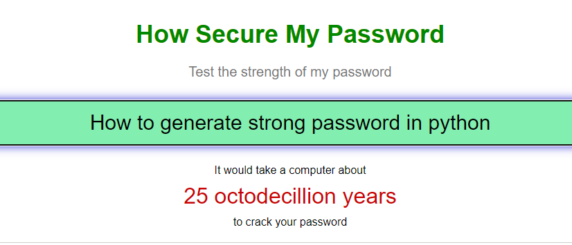

# How to Generate strong password in python



| ***Date*** | 13-01-2021 |
| --- | --- |
| ***Author*** | Thanakorn P. |

วันนี้เราจะมาทดลองทำการ Generate Strong password กัน โดยใช้งาน library ที่ชื่อว่า [random-password-generator](https://pypi.org/project/random-password-generator/) ซึ่งน่าจะมีประโยชน์เวลาที่เราทำการ Generate password ครั้งแรกให้กับ User ของเรา 

***Install package***
```sh
pip install random-password-generator
```

หนึ่งในสิ่งที่จะทำให้ password ของเรา strong ก็คือการกำหนด policy ของ password ให้มี combination ต่างๆ อธิเช่น ตัวพิมพ์เล็ก ตัวพิมพ์ใหญ่ ตัวเลข อักขระพิเศษ และความยาวของ password ซึ่งเราจะกำหนดไว้ตามนี้

***Password Policy***
```sh
minlen = 8      # ความยาวขั้นต่ำ 8 ตัว
maxlen = 8      # ความยาวสูงสุด 8 ตัว
minuchars = 1   # มีตัวพิมพ์ใหญ่อย่างน้อย 1 ตัว
minlchars = 1   # มีตัวพิมพ์เล็กอย่างน้อย 1 ตัว
minnumbers = 1  # มีตัวเลขอย่างน้อย 1 ตัว
minschars = 1   # มีอักขระพิเศษอย่างน้อย 1 ตัว
```

และเราก็นำ policy นี้ไป apply ใน code ของเรา ก็จะได้ code ที่มีหน้าตาดังนี้

***Sample code***

```python
from password_generator import PasswordGenerator

pwo = PasswordGenerator()

# set password policy
pwo.minlen = 8  # (Optional)
pwo.maxlen = 8  # (Optional)
pwo.minuchars = 1  # (Optional)
pwo.minlchars = 1  # (Optional)
pwo.minnumbers = 1  # (Optional)
pwo.minschars = 1  # (Optional)

strong_password = pwo.generate()

print(f'password : {strong_password}')
```

***Result***
```sh
password : EK>SoN1L
```

จะเห็นได้ว่าการ Generate strong password นั้นไม่ได้ยากเลย ลองนำไปปรับใช้กันดูนะครับ

ref : [https://pypi.org/project/random-password-generator/](https://pypi.org/project/random-password-generator/)