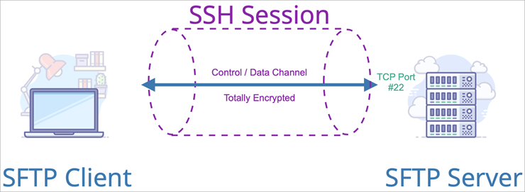
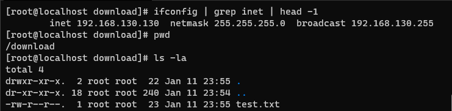
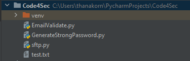

# How to download file from SFTP server in python



Credit : [Image Source](https://exavault.medium.com/what-is-sftp-the-smart-business-file-transfer-solution-3763174503c0)

| ***Date*** | 14-01-2021 |
| --- | --- |
| ***Author*** | Thanakorn P. |

การรับ-ส่ง ข้อมูล ระหว่าง Client และ Server ให้มีความปลอดภัยมีอยู่ด้วยกันหลายวิธี หนึ่งในวิธีการที่ได้รับความนิยมก็คือการใช้งาน [SFTP](https://en.wikipedia.org/wiki/SSH_File_Transfer_Protocol) (SSH File Transfer Protocol) โดยวิธีการนี้จะทำการ รับ-ส่ง ข้อมูลกันผ่าน SSH tunnel ที่มีการเข้ารหัสข้อมูล ทำให้การดักจับข้อมูล ระหว่างที่ทำการ รับ-ส่ง ข้อมูล เป็นไปได้ยากขึ้น จึงทำให้มีความปลอดภัยมากขึ้นนั่นเอง

วันนี้จะมาเขียนโปรแกรมเพื่อทำการ download file จาก SFTP server กัน โดยใช้ library ของ python ที่ชื่อว่า pysftp โดยสิ่งแรกที่ต้องทำเลยคือการ install package library

***Install pysftp***
```sh
pip install pysftp
```

pysftp จะมีตัวอย่างการใช้งานตามตัวอย่างนี้

***Sample Code***

```python
import pysftp

with pysftp.Connection([hostname or ip], username=[user of SFTP Server], password=[password of SFTP Server]]) as sftp:
    with sftp.cd([Directory of file]):
        sftp.get([File name])
```

โดยเมื่อแทนที่ต่างๆ ใน Code แล้ว จะได้ Code ที่มีหน้าตาดังนี้

***Source Code***

```python
import pysftp

with pysftp.Connection('192.168.130.130', username='root', password='password') as sftp:
    with sftp.cd('/download'):
        sftp.get('test.txt')
```

และผมได้ทำการจัดเตรียม SFTP ที่มี setup ตามที่ระบุใน Code ไว้เรียบร้อยตามนี้

***SFTP Server***



และเมื่อทำการทดสอบ Run program ของเรา ก็จะพบว่ามี file ที่ชื่อว่า test.txt เข้ามาอยู่ใน folder ที่ใช้เก็บ sourcecode ของเราเป็นที่เรียบร้อย

***Result***



จะเห็นได้ว่า การ download file จาก sftp server ด้วย library pysftp ใช้ code เพียงไม่กี่บรรทัด ก็สามารถ download file ให้มีความปลอดภัยได้แล้ว

library pysftp ยังมีความสามารถอีกมายมาย เพื่อนๆ ลองไปศึกษาดูได้จาก link reference ด้านล่างครับ...

ref : [https://pysftp.readthedocs.io/en/release_0.2.9/index.html](https://pysftp.readthedocs.io/en/release_0.2.9/index.html)