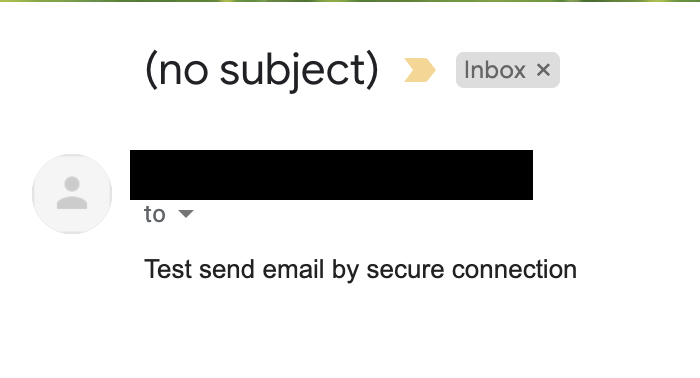

# How to send email by secure connection in python.


Credit : [Image Source](https://www.cisco.com/c/en/us/products/security/what-is-email-security.html)

| ***Date*** | 15-01-2021 |
| --- | --- |
| ***Author*** | Thanakorn P. |

[SMTP](https://en.wikipedia.org/wiki/Simple_Mail_Transfer_Protocol) (Simple Mail Transfer Protocol) เป็น Protocol ที่ในการส่ง email กันมาอย่างยาวนาน และเป็นที่ทราบกันดีว่า Protocol นี้ โดยปกติจะไม่มีการเข้ารหัสข้อมูลที่ส่ง ทำให้ข้อมูลที่ส่งมีความปลอดภัยน้อยลง เพราะสามารถดักจับข้อมูลที่ส่งผ่าน network ได้

ต่อมาจึงได้มีการเพิ่มเติมความสามารถให้กับ Protocol SMTP ให้มีความสามารถในการเข้ารหัส ระหว่างการส่งข้อมูลจาก Client ไปยัง SMTP server และเรียกวิธีการนี้ว่า [SMTPS](https://en.wikipedia.org/wiki/SMTPS) (Simple Mail Transfer Protocol Secure)

วันนี้เราเลยจะมาทำการส่ง email แบบ SMTPS ด้วย python กัน 

***หมายเหตุ*** : การส่ง email ด้วย SMTPS นั้น SMTP server จะต้องรองรับด้วย ซึ่งในการทดสอบนี้ ผมได้ทดสอบส่ง email ด้วย SMTP server ของ Gmail ที่รองรับ SMTPS

***Sample Code***
```python
import smtplib
import ssl

user = 'email@test.com'
password = 'EmailPassword'

# สร้าง ssl default setting
context = ssl.create_default_context()

# เลือกใช้ Protocol TLS version 1.2 ในการเข้ารหัส
context.options = ssl.PROTOCOL_TLSv1_2 

# ทำการ connect ไปยัง smtp server ด้วย Port 465 และ config TLS ตาม setting ที่เราเลือกไว้
with smtplib.SMTP_SSL("smtp.gmail.com", 465, context=context) as server:

    # ทำการ login
    server.login(user, password)

    # ทำการส่ง email
    server.sendmail('email@test.com', 'receiver@test.com', 'Test send email by secure connection')
    print('Send mail success')
```

และเมื่อทำการทดสอบส่ง email ก็จะพบว่า สามารถส่ง email ออกไปได้



หวังว่าบทความนี้จะช่วยเพิ่มความปลอดภัยให้กับการส่ง email ด้วย ภาษา Python ไม่มากก็น้อยนะครับ 

| ***reference***   
| -----
| [https://docs.python.org/3/library/ssl.html#ssl.PROTOCOL_TLS](https://docs.python.org/3/library/ssl.html#ssl.PROTOCOL_TLS)
|[https://docs.python.org/3/library/smtplib.html](https://docs.python.org/3/library/smtplib.html)