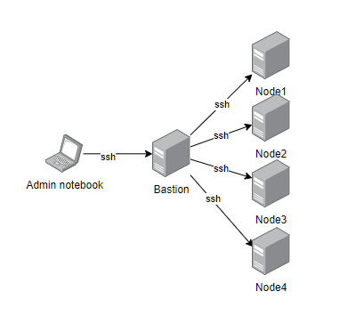
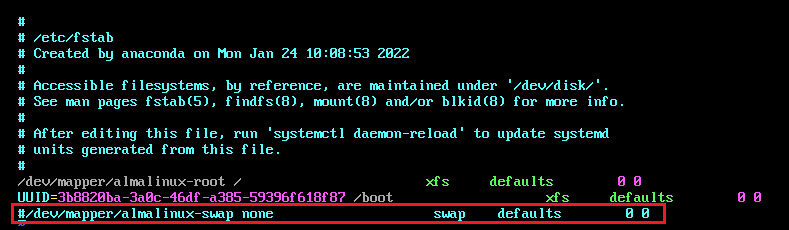
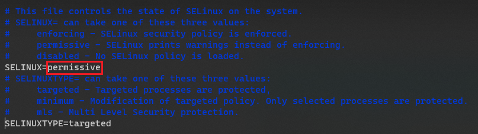
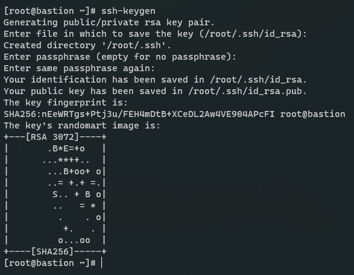
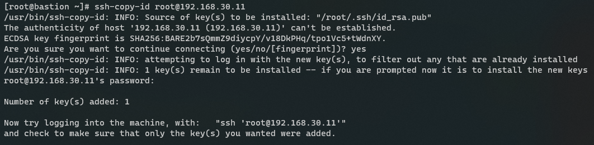
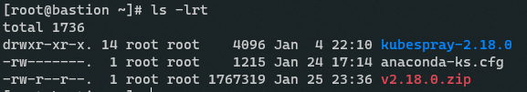
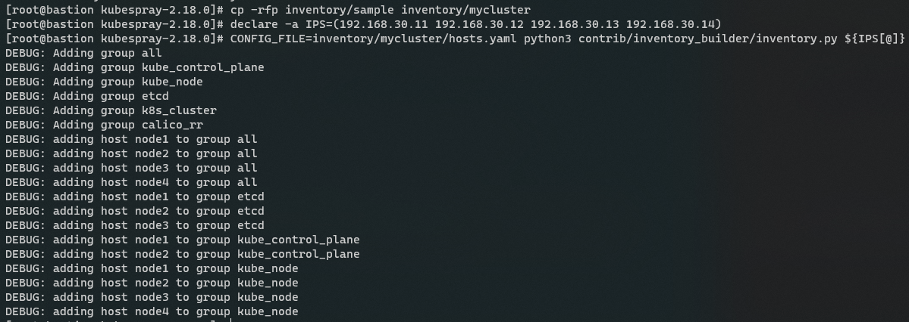
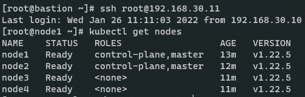

# Install K8S by kubespray

| ***Date*** | 26-01-2022 |
| --- | --- |
| ***Author*** | Thanakorn P. |

## Pre-requisite

ควรเข้าใจ command ของ linux เบื้องต้น และ เราจะเริ่มโดยการเตรียมเครื่อง Server ทั้งหมดดังภาพดังล่าง



โดยเครื่อง Server ที่ใช้ทำเป็น node และ bastion ทั้งหมดจะใช้ configuration ดังนี้ครับ

| OS | Almalinux 8.5 (minimal and standard install) |
| --- | --- |
| CPU | 2 core |
| Memory | 3 GB |
| Disk | 30 GB |

และมี fix ip address ดังนี้

| Bastion | 192.168.30.10 |
| --- | --- |
| node1 | 192.168.30.11 |
| node2 | 192.168.30.12 |
| node3 | 192.168.30.13 |
| node4 | 192.168.30.14 |

Server ทุกเครื่องจะถูกปิด swap โดยวิธีการดังนี้
* ทำการ comment code ใน file /etc/fstab ตามรูปภาพ
  
  

* run command

```sh
swapoff -a
```
* ทำการปรับโหมดของ selinux จาก enforcing เป็น permissive โดยแก้ file /etc/selinux/config ตามภาพ

  

* และทำการ reboot

___________________________________________

ต่อมาเราจะทำการ Generate ssh key pair 1 คู่เพื่อใช้สำหรับเครื่อง bastion ทำการ ssh ไปหาเครื่อง node ทุกเครื่อง แทนการ login ด้วย password

* ssh จากเครื่อง laptop ไปยัง bastion และ run command เพื่อสร้าง ssh key pair โดยใช้คำสั่ง

```sh
ssh-keygen
```
และทำการ enter 2-3 ครั้ง เพื่อใช้ค่า default ในการ generate key ตามรูปด้านล่าง

  

* จากนั้นทำการ copy public key ไปยังเครื่อง node ต่างๆ โดยใช้ command

```sh
ssh-copy-id [user]@[node ip address]
```

ตามตัวอย่าง จะเป็นการ copy ssh public key ไปยังเครื่อง 192.168.30.11 โดยใช้ user root

 

ทำให้ครบทุก node
 ___________________________________________

 ต่อมาเราจะทำการ install package พื้นฐานให้กับทุกเครื่อง

* ทำการ run command

```sh
dnf install python3 upzip tar -y
ln -s /usr/bin/python3 /usr/bin/python
```

* ทำการ disable firewall ด้วย command

```bash
systemctl stop firewalld
systemctl disable firewalld
```

ครบทุก node แล้ว ก็จะไปยังขั้นนตอนต่อไปครับ

## Install K8S cluster

การ install K8S ด้วย kubespray เราจะทำที่เครื่อง bastion นะครับ อันดับแรกทำการ Download Kube-spray มาที่เครื่อง bastion ก่อน แต่เครื่องที่ผมใช้ยังไม่มี wget ที่ใช้ download kubespray ผมจะทำการติดตั้งก่อน ด้วย command นี้

```sh
dnf install wget -y
```

จากนั้น download kubespray ที่เป็นไฟล์ .zip

```sh
wget https://github.com/kubernetes-sigs/kubespray/archive/refs/tags/v2.18.0.zip
```

และก็ทำการ extract zip ด้วย command

```sh
unzip v2.18.0.zip
```

เราก็จะได้ Directory kubespray-2.18.0 มาตามรูป

 

จากนั้น cd เข้าไปยัง Directory kubespray-2.18.0 และ run command เพื่อติดตั้ง package ของ python ตาม requirement ของ kubespray

```sh
pip3 install -r requirements.txt
```

รอซักครู่นึง เมื่อเครื่อง bastion ทำการ install ตาม requirement เรียบร้อยแล้ว ให้ run command ตามด้านล่างนี้ จะได้ผมลัพท์ตามรูป

```sh
cp -rfp inventory/sample inventory/mycluster
declare -a IPS=([node1 ip] [node2 ip] [node3 ip] [node4 ip])
CONFIG_FILE=inventory/mycluster/hosts.yaml python3 contrib/inventory_builder/inventory.py ${IPS[@]}
```

 

ทำการ check configuration อีกรอบด้วย command

```sh
cat inventory/mycluster/group_vars/all/all.yml
cat inventory/mycluster/group_vars/k8s_cluster/k8s-cluster.yml
```

เมื่อพร้อมแล้วก็ run command เพื่อติดตั้ง k8s

```sh
ansible-playbook -i inventory/mycluster/hosts.yaml  --become --become-user=root cluster.yml
```

หมายเหตุ : ขั้นตอนนี้ค่อนข้างนาน

เมื่อ kubespray ทำการ install เสร็จเรียบร้อย เราจะทำการทดสอบโดยการ ssh ไปยัง master node และใช้งาน command

```sh
kubectl get nodes
```

ถ้าได้ผลลัพท์ตามรูปด้านล่าง ถือว่าเป็นอันเรียบร้อย สำหรับการ install K8S ด้วย kubespray

 