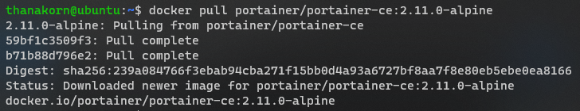
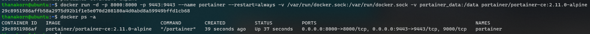
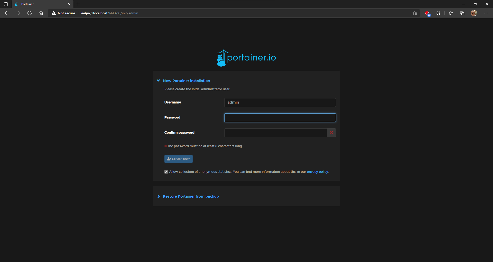

# Install Portainer

| ***Date*** | 24-01-2022 |
| --- | --- |
| ***Author*** | Thanakorn P. |

ทำการสร้าง Volume สำหรับ portainer ด้วย command 

```sh
docker volume create portainer_data
```


ทำการ pull image ของ portainer มาเก็บไว้ที่เครื่องด้วย command

```sh
docker pull portainer/portainer-ce:2.11.0-alpine
```



จากนั้นทำการ Download docker image และ install ด้วย command 

```sh
docker run -d -p 8000:8000 -p 9443:9443 --name portainer --restart=always -v /var/run/docker.sock:/var/run/docker.sock -v portainer_data:/data portainer/portainer-ce:2.11.0-alpine
```



ลองทำการ login เพื่อเข้าใช้ portainer ผ่านทาง url นี้

```sh
https://localhost:9443
```



ก็จะพบกับหน้า web ของ portainer ก็ลองๆ ไปใช้งานกันดูนะครับ