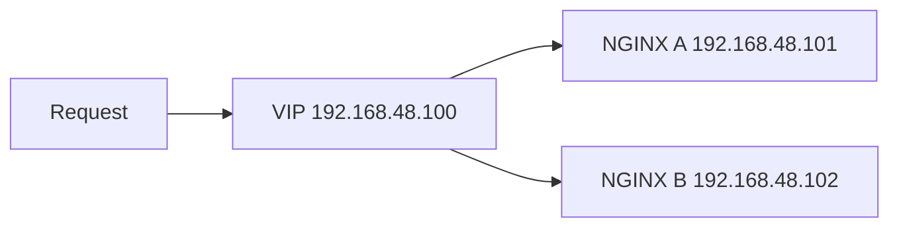

```mermaid
flowchart LR
    REQUEST[Request] --> VIP
    VIP[VIP 192.168.48.100] --> A[NGINX A 192.168.48.101]
    VIP[VIP 192.168.48.100] --> B[NGINX B 192.168.48.102]
```

```sh
dnf install net-tools epel-release vim nginx keepalived -y
```