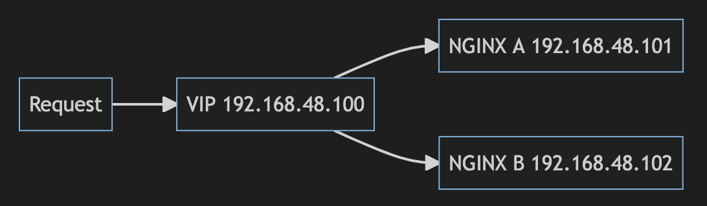

# Nginx HA by Keepalived

| ***Date*** | 17-7-2022 |
| --- | --- |
| ***Author*** | Thanakorn P. |

เนื่องจากได้ยินมาบ่อยๆ ว่า Nginx ทำ HA ไม่ได้ ต้องใช้งานเป็น Nginx+ เลยเกิดความสงสัย มันจะไม่ได้เลยจริงๆ หรอ ผมเลยได้ทำการ research และก็พบว่ามีวิธีทำได้ ไม่เห็นต้องใช้ Nginx+ เลย วันนี้เลยจะมาลองทำกันดูครับ โดยมีรูปแบบการทำงานตาม Diagram ด้านล่างนี้



และ Lab ที่จะใช้กันในวันนี้จะมี spec ดังนี้ครับ

| Nginx and Keepalived server spec| |
| --- | --- |
| OS | Rocky Linux 8.6 (minimal and standard install) 
| CPU | 1 core |
| Memory | 2 GB |
| Disk | 20 GB |

และมี fix ip address ดังนี้

| IP Address |  |
| --- | --- |
| VIP IP | 192.168.48.100 |
| NginX A | 192.168.48.101 |
| NginX B | 192.168.48.102 |

```bash
dnf install net-tools epel-release vim nginx keepalived -y
```